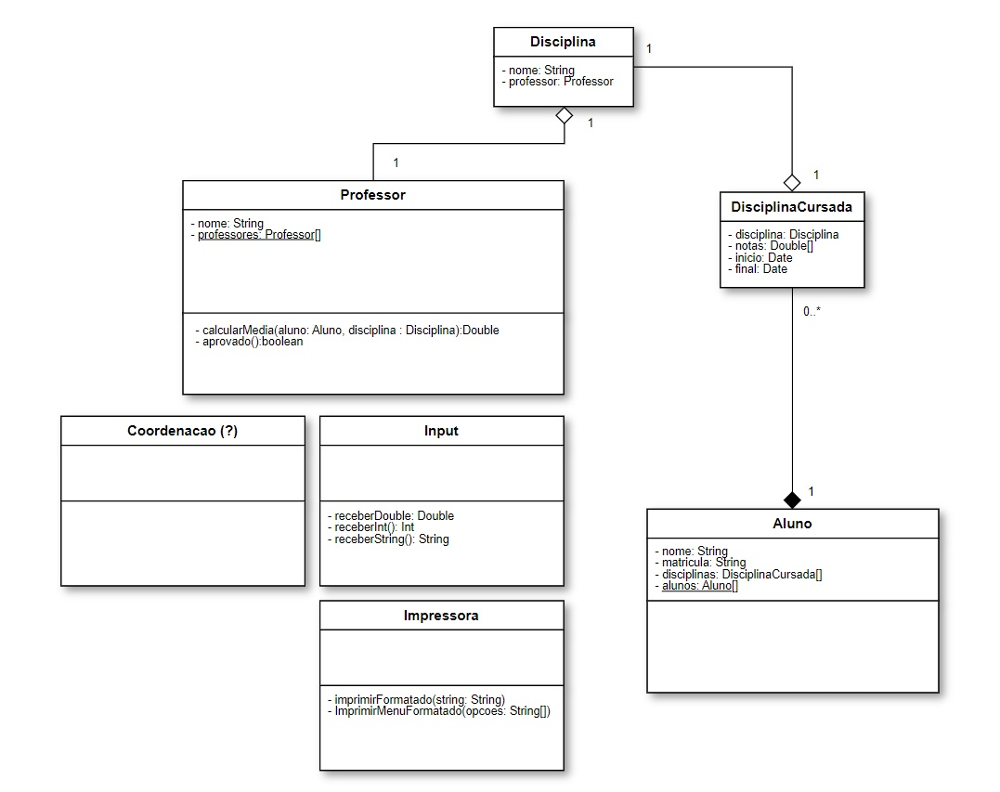

[English](README.pt-br.md) | [Português](README.pt-br.md)

## OOP Classroom

This project is a Java application that emulates the structure of an educational institution. 
It was made as part of the first OOP module in an [intensive training program](https://polotech.americanas.io/) 
by [Ada](https://ada.tech/sou-aluno).

The project consists of several classes that represent different entities within the educational 
institution, such as students, teachers, and courses. The classes are designed to interact with
each other in a way that reflects the real-world relationships between these entities.

## Class Diagram

    

